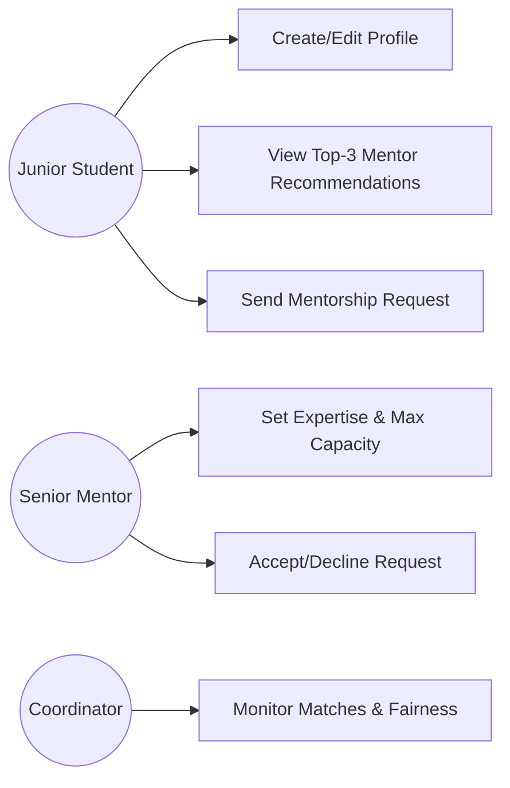
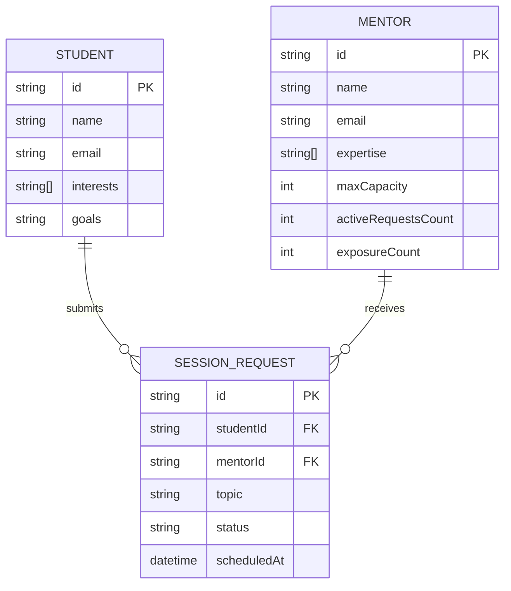

# MentorLink Diagrams (Phase 1)

## Use-Case Diagram (Mermaid)

```mermaid
flowchart LR
  Student((Junior Student))
  Mentor((Senior Mentor))
  Coord((Coordinator))

  Student --> UC1[Create/Edit Profile]
  Student --> UC2[View Top-3 Mentor Recommendations]
  Student --> UC3[Send Mentorship Request]
  Mentor --> UC4[Set Expertise & Max Capacity]
  Mentor --> UC5[Accept/Decline Request]
  Coord --> UC6[Monitor Matches & Fairness]
```

## ER / Class Diagram (Mermaid)

```mermaid
erDiagram
  STUDENT ||--o{ SESSION_REQUEST : submits
  MENTOR ||--o{ SESSION_REQUEST : receives
  STUDENT {
    string id PK
    string name
    string email
    string[] interests
    string goals
  }
  MENTOR {
    string id PK
    string name
    string email
    string[] expertise
    int maxCapacity
    int activeRequestsCount
    int exposureCount
  }
  SESSION_REQUEST {
    string id PK
    string studentId FK
    string mentorId FK
    string topic
    string status
    datetime scheduledAt
  }
```
